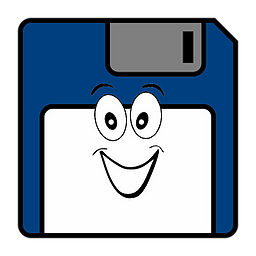

# Gammasoft

G a m m a s o f t   a i m s   t o   m a k e   c + +   f u n   a g a i n .

<!---  --->

# About

* More than thirty years of passion for high technology especially in development (c++, c#, objective-c, ...).
* Object-oriented programming is more than a mindset.

for more info see :

* [website](https://gammasoft71.wixsite.com/gammasoft)  [https://gammasoft71.wixsite.com/gammasoft](https://gammasoft71.wixsite.com/gammasoft) 
* [markdown doocumentation](docs/home.md)
* [sources](https://github.com/gammasoft71)

# Main Projects

|                                                                              | Project                                               | Brief                                                                                                                      |
|------------------------------------------------------------------------------|-------------------------------------------------------|----------------------------------------------------------------------------------------------------------------------------|
|              | [xtd](https://github.com/gammasoft71/xtd)             | Modern c++17 framework to create console, gui and unit test applications on  Windows, Apple macOS, Linux, iOS and android. |
|  | [xtd.tunit](https://github.com/gammasoft71/xtd_tunit) | Modern c++17 unit testing framework on Microsoft Windows, Apple macOS, Linux, iOS and android.                             |
|    | [examples](https://github.com/gammasoft71/examples)   | shows how to use gui controls with some common toolkits.                                                                   |
