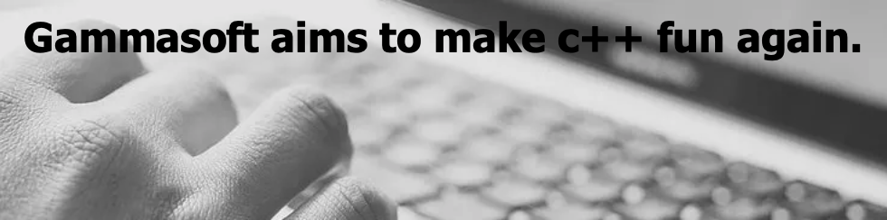

| [Home](home.md) | [Libraries](libraries.md) | [examples](examples.md) | [Projects](https://sourceforge.net/u/gammasoft71) | [Contact](contact.md) | [Website](https://gammasoft71.wixsite.com/gammasoft) |

# Gammasoft is...

* More than thirty years of passion for high technology especially in development (c++, c#, objective-c, ...).
* Object-oriented programming is more than a mindset.

# ... also

* The c++ is my favorite language, naturaly followed by c#.
* I like Apple products for their simplicity of use but I also admire the technologies of Microsoft for their efficiency as for example the .Net Framework.
* Gammasoft name was created by analogy to Microsoft. I know... but I was young at this time.

______________________________________________________________________________________________

© 2021 Gammasoft.
